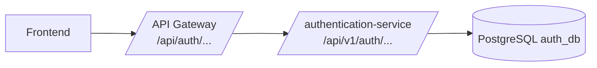

# authentication-service

## Integracion con API Gateway

Este servicio ya esta preparado para ejecutarse detras del gateway:

- Usa `server.forward-headers-strategy=framework`.
- Genera links HAL con URL externa (gateway) respetando `X-Forwarded-*`.
- Se configura por perfil con `.env.dev` y `.env.prod`.

## Variables por perfil

- Desarrollo local: `.env.dev`
- Produccion: `.env.prod`

Arranque local del auth-service:

```bash
SPRING_PROFILES_ACTIVE=dev ./mvnw spring-boot:run
```

Arranque local solo de auth con su base:

```bash
docker compose up -d --build
```

## Mapa de rutas (gateway -> auth-service)

Rutas publicas del gateway:

- `POST /api/auth/login` -> `POST /api/v1/auth/login`
- `POST /api/auth/refresh` -> `POST /api/v1/auth/refresh`
- `GET /api/auth/me` -> `GET /api/v1/auth/me`
- `GET /api/auth/admin/**` -> `GET /api/v1/admin/**`
- `GET /api/auth/v3/api-docs` -> `GET /v3/api-docs`
- `GET /api/auth/swagger-ui/**` -> `GET /swagger-ui/**`



## Stack combinado (gateway + auth + db)

Para levantar todo junto, usa el compose del gateway:

```bash
cd ../gateway-service
cp .env.example .env
docker compose up -d --build
```

Gateway local:

- `http://localhost:8080`

## Recomendaciones de integracion

- Expon al frontend solo el dominio del gateway.
- En `CORS_ORIGINS` usa el origen publico del frontend/gateway.
- `8080` puede seguir siendo puerto interno del microservicio, pero en produccion no lo publiques directo a internet.